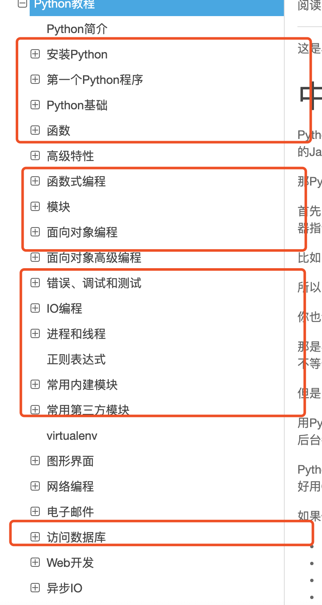

# 校招周刊 -- 第二期

当前时间 2019-12-20, 对于参加 2020 校招的你, 应该做的事情: 

准备复习, 冲击春招实习,

本期话题: 

## 技术岗的分类和我的一些个人建议

前端, 后端,算法岗.... 安卓,ios, java, C++工程师.. 互联网技术岗有这么多岗位, 都是干啥的, 我该怎么选?? 这是很多刚刚准备从学校开始找工作的小猿们面临的第一个问题. 今天我就来带大家换个角度带大家搞懂这些是做什么的 以及 一些个人建议.

首先, 我们要明白, 作为一个计算机科学出生的同学, 我们都学了什么, 以及未来的对应方向:

简单来说, 我们的课程有三大类, 一类是基础的数学, 类似高数和线代离散 这种强调对纯数学的理解.  一类是工程类的学科, 如操作系统, 数据库系统, 计算机网络, 强调对人为规定概念的理解, 以及他们的杂交, 这部分既可以认为是 特定领域也就是计算机科学的数学,  也可以理解成 计算机工程的基础, 就是学的一些 经典算法和数据结构, 计算理论,  图形学, 密码学等学科.

当我们有了这个分类以后, 我们就可以和公司招聘的常见岗位对应起来了.

首先是纯数学这边, 主要面对的是 AI 算法 和 数据相关职业, 其实对 计算机工程类的知识要求并不高, 只会用计算机的编程工具即可, 所以很多数学专业的同学也可以从事相关岗位. 

根据面对的业务不同, AI 也会分成做 图形的俗称 cv , 做自然语言的的 俗称 nlp, 还有做音频 和 纯理论的....核心依赖的还是数学基础.

而数据分析挖掘岗位这里主要是负责出一些公司内部的分析报表, 为未来战略制定提供数据支持. 主要要求一些数据库和数学模型分析, 做一些预测分类等常见的统计学任务.

而工程方面, 主要分成 业务开发和基础设施开发, 这部分对你数学要求并不高, 对特定的数学知识几乎没要求, **所以那些让你当码农入门看高数线代的都是\*\***.

基础设施主要是做 os(操作系统), db(数据库), mq(消息队列), cache(缓存)等这些业务码农经常用的基础设施, 大体来讲做的也是业务, 只是业务的需求方是业务程序员. 对技术的要求也是专一, 深入, 基础好.

而业务码农, 在目前这个时代, 大部分业务都是围绕着CS 也就是服务器和客户端这个模型来的. 业务码农核心要求是对基础设施的使用 和 对业务的理解, 还有设计和写出面对业务快速迭代 稳定好维护的代码.

 做 S端的, 也就是服务端, 公司招聘的时候一般叫后台开发, 后端开发, 前面会加某一个特定语言. 如 Python, C++, Java等等, 但本质上就是利用基础设施, 实现出某种业务(广告, 聊天, 社交....)的服务端逻辑, 主要是一些数据的处理和保存的任务. 面临的主要是 所谓的高并发, 高实时, 大数据, 高可用方面的挑战.

 做 C 端的, 也就是俗称的客户端, 一般根据介质的不同分成前端, 安卓, ios, 小程序...本质上都是客户端 随着技术发展现在也有大前端的趋势.
 他们的核心任务, 是使用后端的接口, 做出用户用的界面, 保证交互逻辑的正确和交互体验的优秀.

 算法和工程的交接处, 是一些人容易被大家忽略但是很重要的岗位.

 一部分是特定领域算法, 主要是音视频, 密码学, 图形学等, 比如音视频就是负责直播或者视频传输的过程中怎么压缩, 怎么处理速度快等等, 这些行业的特点是专一, 要求用专业知识和 公司业务情况结合优化算法.

 另一部分是算法开发, 主要是讲一些如推荐, 排序等等大量数据的算法, 还有 AI 工程师的算法 在工程上落地, 能处理公司真正的业务数据.

 我们说完这些岗位了之后, 结合我的看法回答几个问题:

 ### 算法工程师是不是很好?听说薪资很高.

 首先, 目前的语境下, 算法工程师就是指的 AI 算法工程师, 总所周知的看完吴恩达年薪 50w, 各大高校的实验室也都在炼丹搞算法. 而实际上, 这里是一个误区. 研究性的算法工程师, 每个公司就要那么几个, 基本都在 top级别的大厂独角兽的 AIlab , 要求的也是 top 级别的学校的重点实验室的博硕,人手顶会论文,门槛极高. 他们要去的是纯数学, 对工程要求很低. 而真正需求量大的算法工程师, 其实是算法开发, 这个对你代码能力, 工程能力, 要求是很高的. 而现在很多学生只看到了研究岗位的高新缺门看到门槛, 学校里也不重视计算机工程的学习天天炼丹, 导致炼丹岗位基本普通人很难找, 而工程能力又不行算法开发也过不了. 普通人还是要重视自己的计算机工程基础, 不要天天想着炼丹了.

### 做基础设施比做业务好?技术含量高?

首先明确观点技术脱离业务是不产生价值的, 公司要的不是一个又一个轮子, 要的是让轮子经过改良适合走公司的路, 从这个意义讲, 大家都在为公司的业务服务, 只是业务程序员的需求方是客户, 而基础设施的程序员的需求方是其他程序猿. 

不过就技术进步而讲, 做基础设施确实对技术的培养更好, 进步更快, 因为你得了解你得需求方想到的没想到的. 但是随之而来的也有:

1. 基础设施跳槽空间小, 可能大部分公司用开源的轮子就够, 而需要定制的就那么几个 top 大厂, 跳槽要麻烦一些

2. 没办法跟上业务扩张的红利, 比如你再广告部门, 随着公司扩展, 你的绩效也很好看, 虽然和你的技术没太大关系, 而基础设施只能看你的技术

### 前端不好?

今年其实后端算法竞争都比较激烈, 而客户端远远的供小于求, 某条的客户端甚至 0 客户端开发基础都可以面试的情况.

造成这个原因的主要是, 很多搞客户端的同学以为自己会安卓会 web 就行, 忽视了基础的培养. 很多时候没有想明白, 其实浏览器, 安卓系统, 就是操作系统, 你要想写出好的代码, 内存任务等操作系统的概念 和 那些计算机基础是必不可少的. 这导致了企业想找计算机基础好的客户端, 而计算机基础好的人往往会做后端. 

所以如果你能打好你的基础, 去做客户端, 那必将是各个大厂抢手的优秀人才.是一个很棒的路线.